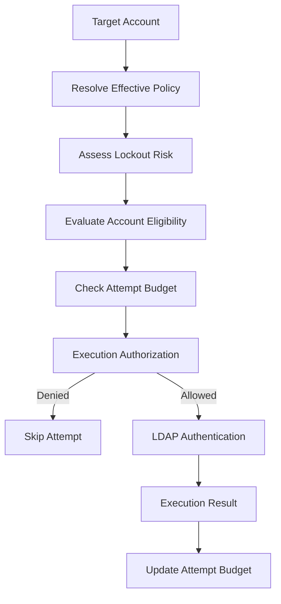
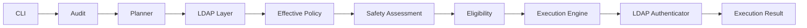

<p align="center">
  
  
  
  
</p>

<p align="center">
  <a href="https://github.com/pullsec/lockoutlens">Repository</a> ·
  <a href="https://github.com/pullsec/lockoutlens/issues">Report Bug</a> ·
  <a href="https://github.com/pullsec/lockoutlens/pulls">Request Feature</a>
</p>

---

<details>
  <summary>Table of Contents</summary>

- [About](#about)
- [Key Features](#key-features)
- [Safety Model](#safety-model)
- [Architecture](#architecture)
- [Repository Structure](#repository-structure)
- [Technology Stack](#technology-stack)
- [Installation](#installation)
- [Usage](#usage)
- [Attempt Budgets](#attempt-budgets)
- [LDAP Authentication](#ldap-authentication)
- [Testing](#testing)
- [Security Considerations](#security-considerations)
- [Current Status](#current-status)
- [Roadmap](#roadmap)
- [Development Workflow](#development-workflow)
- [License](#license)

</details>

## About

LockoutLens is a Python project focused on safely assessing Active Directory account lockout conditions before controlled authentication attempts are performed.

The project separates policy discovery, lockout assessment, account eligibility, execution authorization, authentication, and attempt accounting into distinct components.

> [!IMPORTANT]
> LockoutLens follows a fail-closed execution model.
>
> An authentication attempt should not be performed unless the required safety conditions have been evaluated successfully.

LockoutLens is currently under active development and should be validated in a controlled Active Directory lab before being considered for production use.

## Key Features

Current project capabilities include:

- Active Directory LDAP connectivity;
- LDAP and LDAPS server configuration;
- certificate validation for LDAPS;
- Active Directory naming-context discovery;
- domain lockout policy inspection;
- Fine-Grained Password Policy / PSO handling;
- effective account policy resolution;
- account classification and eligibility checks;
- lockout risk assessment;
- dry-run account planning and auditing;
- per-account and global authentication attempt budgets;
- fail-closed execution authorization;
- LDAP authentication adapter;
- structured execution results;
- explicit handling of authentication execution errors;
- automated tests for safety and execution behavior.

## Safety Model

LockoutLens treats authentication as the final step of a safety pipeline rather than the first operation.



| Gate | Purpose |
| --- | --- |
| Effective policy | Determine the policy applicable to the target account |
| Lockout assessment | Evaluate whether an authentication attempt is considered safe |
| Eligibility | Prevent execution against accounts that do not satisfy safety requirements |
| Per-account budget | Limit authentication attempts for an individual account |
| Global budget | Limit total attempts across an execution campaign |
| Authentication adapter | Isolate LDAP authentication from execution orchestration |
| Execution result | Return an explicit and auditable outcome |

> [!WARNING]
> A successful dry-run or previous assessment should not be considered permanent authorization. Active Directory state may change between assessment and execution.

## Architecture



### Component Responsibilities

| Component | Responsibility |
| --- | --- |
| `audit.py` | Account audit orchestration |
| `planner.py` | Dry-run account planning |
| `classification.py` | Account classification |
| `safety.py` | Lockout safety assessment |
| `eligibility.py` | Account execution eligibility |
| `execution.py` | Authorization, attempt budgets and execution results |
| `ldap/client.py` | LDAP server and connection handling |
| `ldap/auth.py` | Target-account authentication adapter |
| `ldap/policy.py` | Active Directory policy retrieval |
| `ldap/pso.py` | Fine-Grained Password Policy handling |
| `ldap/effective_policy.py` | Effective policy resolution |
| `ldap/users.py` | Active Directory user operations |
| `ldap/exceptions.py` | LDAP-specific exceptions |
| `exceptions.py` | Application-level execution exceptions |
| `cli.py` | Command-line interface |

## Repository Structure

```text
.
├── src/
│   └── lockoutlens/
│       ├── audit.py
│       ├── classification.py
│       ├── cli.py
│       ├── eligibility.py
│       ├── exceptions.py
│       ├── execution.py
│       ├── formatting.py
│       ├── planner.py
│       ├── safety.py
│       └── ldap/
│           ├── ad.py
│           ├── auth.py
│           ├── client.py
│           ├── effective_policy.py
│           ├── exceptions.py
│           ├── policy.py
│           ├── pso.py
│           └── users.py
├── tests/
├── pyproject.toml
└── README.md
```

## Technology Stack

| Component | Technology |
| --- | --- |
| Language | Python |
| Directory integration | Active Directory |
| LDAP library | `ldap3` |
| Transport | LDAP / LDAPS |
| TLS validation | Python `ssl` |
| Testing | `pytest` |
| Packaging | `pyproject.toml` |
| Source control | Git |
| Repository hosting | GitHub |

## Installation

```bash
git clone https://github.com/pullsec/lockoutlens.git
cd lockoutlens

python -m venv .venv
source .venv/bin/activate
```

Install the project and development dependencies according to `pyproject.toml`.

> [!NOTE]
> LockoutLens is under active development. Review the current package configuration and CLI before deploying it outside a lab environment.

## Usage

Inspect the available command-line interface with:

```bash
lockoutlens --help
```

LockoutLens currently provides dry-run auditing and planning components while the controlled execution engine is being developed and hardened.

> [!CAUTION]
> Use LockoutLens only against systems and accounts for which you have explicit authorization. Validate authentication and lockout behavior in a dedicated lab before using the project against production infrastructure.

## Attempt Budgets

LockoutLens uses explicit attempt budgets to bound authentication activity.

```text
AttemptBudget
├── attempts_for_account
├── max_attempts_per_account
├── total_attempts
└── max_total_attempts
```

| Budget | Scope | Purpose |
| --- | --- | --- |
| Account budget | Single account | Prevent excessive attempts against one account |
| Global budget | Execution campaign | Bound total authentication attempts |

Missing, invalid, or exhausted budgets block authorization.

## LDAP Authentication

Target-account authentication is isolated behind `LDAPAuthenticator`.

```text
Execution Engine
      │
      ▼
LDAPAuthenticator
      │
      ▼
    ldap3
      │
      ▼
Active Directory
```

The adapter exposes a small contract to the execution engine:

```text
successful bind       → True
rejected credentials  → False
execution error       → AuthenticationError
```

LDAP connections are explicitly unbound after authentication attempts, including tested error paths.

## Testing

Run the complete test suite:

```bash
pytest -v
```

Run execution and LDAP authentication tests independently:

```bash
pytest tests/test_execution.py -v
pytest tests/test_ldap_auth.py -v
```

Before committing changes:

```bash
git diff --check
pytest -v
git status
```

The project follows a small test-driven workflow:

```text
Write safety contract
        │
        ▼
       RED
        │
        ▼
Minimal implementation
        │
        ▼
      GREEN
        │
        ▼
Full regression suite
        │
        ▼
Review diff
        │
        ▼
Commit
```

## Security Considerations

### Fail Closed

Authentication should be refused when required safety information is missing or invalid, including unknown lockout state, unsafe assessments, missing eligibility information, invalid budgets, and exhausted attempt limits.

### Credentials

Credentials must not be exposed through command history, logs, exception messages, debug output, serialized objects, or source control. Production credential handling should avoid plaintext command-line arguments.

### LDAP Transport

LDAPS support uses certificate validation. Production deployments should use authenticated and encrypted LDAP transport according to the environment's security policy, without disabling certificate verification merely to bypass TLS deployment problems.

### Logging

Operational logging should provide enough information to audit execution decisions without recording secrets. Useful fields include target, policy source, assessment, eligibility decision, attempt number, execution result, reason, and timestamp.

## Current Status

LockoutLens is currently in active development. The implementation contains the safety and execution primitives required to authorize and perform an individual controlled authentication attempt, but the execution engine is not yet considered production-ready.

> [!WARNING]
> Passing unit tests does not by itself establish production safety. Active Directory integration testing, credential handling, network failure behavior, execution hardening, and operational safeguards must also be validated.

## Roadmap

- [x] LDAP connection abstraction
- [x] Active Directory policy retrieval
- [x] effective policy resolution
- [x] lockout safety assessment
- [x] account eligibility model
- [x] dry-run account planning
- [x] execution authorization
- [x] per-account attempt budget
- [x] global attempt budget
- [x] execution result model
- [x] LDAP authentication adapter
- [x] authentication error translation
- [ ] multi-account execution orchestration
- [ ] fresh safety revalidation immediately before execution
- [ ] execution CLI
- [ ] production credential handling
- [ ] structured audit logging
- [ ] LDAP timeout and network hardening
- [ ] production TLS policy
- [ ] Active Directory integration tests
- [ ] CI validation
- [ ] packaging and release validation
- [ ] production release

## Development Workflow

Development is performed on feature branches and validated before merge.

```bash
git switch -c feat/example
```

Before committing:

```bash
pytest -v
git diff --check
git diff
git status
```

Commit focused changes using Conventional Commit-style messages:

```bash
git add <files>
git commit -m "feat: describe the change"
git push
```

Safety-related behavior should be introduced through tests whenever practical.

